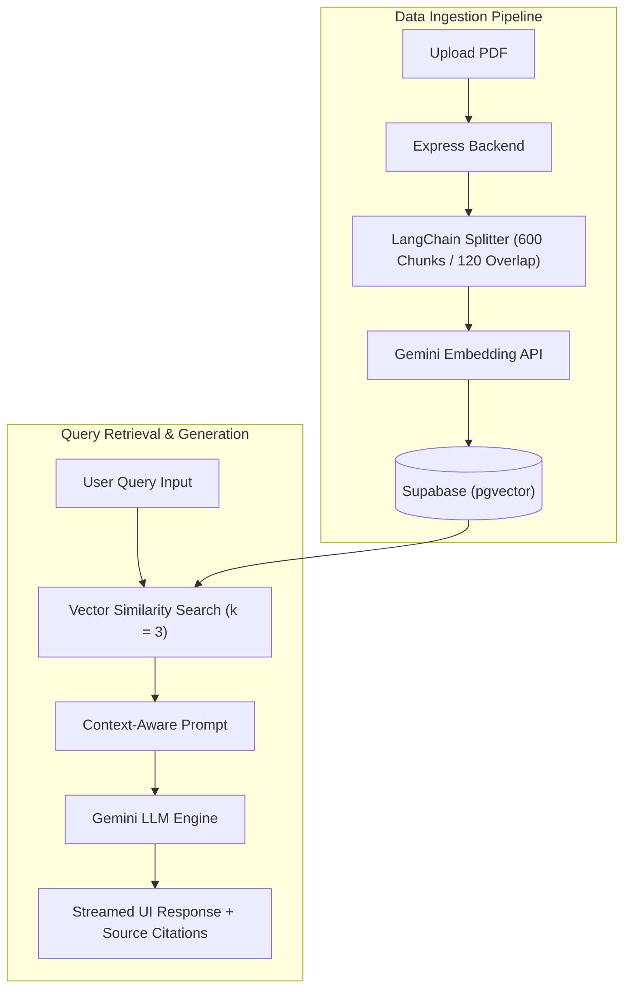

# Enterprise RAG Knowledge Engine

A decoupled, production-ready Full-Stack **Retrieval-Augmented Generation (RAG)** application designed to parse, chunk, vectorize, and query multi-tenant PDF document contexts without cross-document data bleeding.

🔗 **[Live Demo](https://fullstack-rag-knowledge-engine.vercel.app/)** | 🛠️ **Backend API:** Deployed on Render

---

## 🚀 Key Architectural Features

* **Semantic Ingestion Pipeline:** Integrates LangChain's `RecursiveCharacterTextSplitter` to partition unstructured PDF data into optimized semantic chunks (size: 600 characters, 20% overlap) to preserve text syntax.
* **Isolated Vector Search ($k = 3$):** Leverages **Supabase (pgvector)** to execute vector similarity queries mapped with custom metadata filters, enforcing strict execution isolation boundaries across multiple files.
* **Fault-Tolerant API Gateways:** Built-in backend interceptors to gracefully handle HTTP `429 Too Many Requests` status codes and API throttling patterns, mitigating client UI hangs during third-party embedding usage peaks.
* **Modern Interface:** Built an active user dashboard utilizing React and Tailwind CSS featuring stateful file upload components, progress hooks, and structured source fact traceability windows.

---

## 🛠️ Tech Stack

* **Frontend:** React, Tailwind CSS, Axios
* **Backend:** Node.js, Express, LangChain
* **Database & Vector Store:** PostgreSQL + Supabase (`pgvector`)
* **AI Model Engine:** Gemini API (Text Embeddings & Generation)
* **Deployment:** Vercel (Frontend), Render (Backend)

---

## 📋 System Data Flow



---

## ⚙️ Local Development Setup

### 1. Clone the Repository
```bash
git clone [https://github.com/AjinkyaJoshi05/your-repo-name.git](https://github.com/AjinkyaJoshi05/your-repo-name.git)
cd your-repo-name
```
### 2. Environment Variables Configuration

Create a `.env` file in your backend directory:
```env
PORT=5000
GEMINI_API_KEY=your_gemini_api_key
SUPABASE_URL=your_supabase_project_url
SUPABASE_SERVICE_ROLE_KEY=your_supabase_key
```

Create a `.env` file in your frontend directory:
```env
VITE_API_BASE_URL=http://localhost:5000/api
```

### 2. Insatll and run
## Navigate to the backend directory, install dependencies, and start backend
```
cd backend
npm install
node server.js
```
## In a new terminal window, navigate to the frontend directory, install dependencies, and start frontend
```
cd frontend
npm install
npm run dev
```

---

##  Production Security Implementations

### 1. Multi-Tenant Logical Isolation
To prevent cross-document data bleeding in a shared database instance, the backend enforces strict logical indexing boundaries. Every vector embedding is tightly bound to an immutable file metadata tag during the ingestion phase. During query retrieval, the search space is isolated explicitly using database-level metadata filtration:

```javascript
const vectorStore = await SupabaseVectorStore.fromExistingIndex(
  new GoogleGenerativeAIEmbeddings(),
  {
    client: supabaseClient,
    tableName: "documents",
    queryName: "match_documents",
    filter: { file_name: requestedFileName } // Hard isolation layer inside pgvector matching routines
  }
);
```

### 2. Upstream Resource & Rate-Limit Shielding
Large language model embedding architectures are prone to high infrastructure runtime overheads and third-party throttling limits. To handle this gracefully:

* **Custom 429 Interceptors:** Implemented API request handlers that monitor downstream HTTP `429 Too Many Requests` response headers, intercepting token rate blocks gracefully to prevent Express process stalls and frontend UI hangs.
* **Payload Validation:** Enforced explicit file character parsing thresholds within the `RecursiveCharacterTextSplitter` layer to eliminate abnormally large payload allocations before vectors are dispatched to the Gemini API.

---

## 📄 License

Distributed under the MIT License. See `LICENSE` for more information. 
